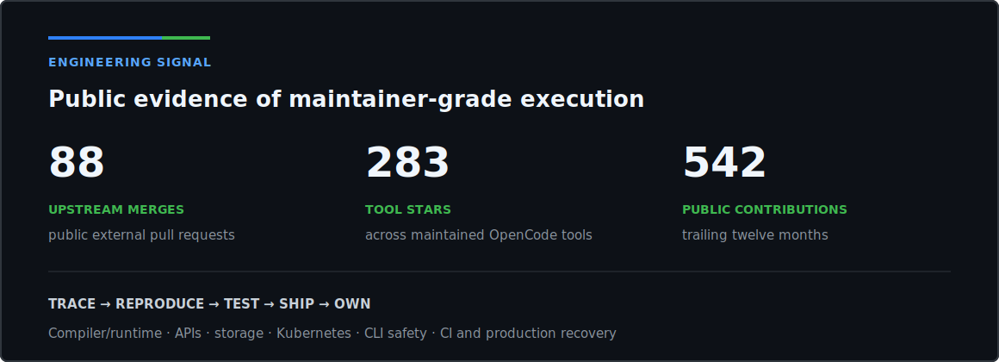

<!-- AUTO-GENERATED from README.template.md; edit the template, not this file. -->

  

  

    
    
  

  

    
    
    
  

I am an **open-source systems engineer** who turns ambiguous, cross-layer failures into shipped, reviewable fixes. I build developer tooling and coding-agent infrastructure, and I operate production systems where correctness, recovery, and observability are not optional.

My public work spans compiler/runtime behavior, Kubernetes policy validation, CLI execution safety, atomic storage, cloud integrations, package resolution, authentication, performance measurement, CI, and deployment reliability.

> I enter unfamiliar systems, find the real failure boundary, build the regression proof, and stay with the change until it is useful upstream.

## Products I maintain

<table>
  <tr>
    <td width="33%" valign="top">
      <h3><a href="https://github.com/floze-the-genius/opencode-multi-auth-codex">opencode-multi-auth-codex</a></h3>
      
A reliability layer for Codex OAuth in OpenCode: account routing, session controls, dashboard, and operational tooling.

      

        
        
      

    </td>
    <td width="33%" valign="top">
      <h3><a href="https://github.com/floze-the-genius/opencode-tps-meter">opencode-tps-meter</a></h3>
      
Makes coding-agent throughput observable with live streaming and final output-token measurements in the OpenCode TUI.

      

        
        
      

    </td>
    <td width="33%" valign="top">
      <h3><a href="https://github.com/floze-the-genius/opencode-status-signals">opencode-status-signals</a></h3>
      
Turns hidden agent state into immediate visual feedback through OpenCode's native theme system.

      

        
        
      

    </td>
  </tr>
</table>

## Proof of work

  

**What I bring to a difficult codebase**

- Deep debugging across runtime, API, storage, infrastructure, and deployment boundaries
- Regression tests and compatibility guards that make risky fixes maintainable
- Production ownership: observability, safe migrations, CI, recovery, and release discipline
- Maintainer-grade follow-through from unclear issue to reviewed, shipped result

## Selected upstream engineering

| Project | Merged contribution | Engineering area |
| --- | --- | --- |
| [Svelte](https://github.com/sveltejs/svelte) | [Preserve select selection with spread attributes](https://github.com/sveltejs/svelte/pull/18561) | Compiler/runtime DOM behavior |
| [Kong kongctl](https://github.com/Kong/kongctl) | [Enforce saved declarative-plan execution modes](https://github.com/Kong/kongctl/pull/1655) | CLI execution safety and test coverage |
| [NGINX Gateway Fabric](https://github.com/nginx/nginx-gateway-fabric) | [Detect conflicting route policies across overlapping hostnames](https://github.com/nginx/nginx-gateway-fabric/pull/5605) | Kubernetes Gateway API validation |
| [zarrs](https://github.com/zarrs/zarrs) | [Add an atomic write storage adapter](https://github.com/zarrs/zarrs/pull/421) | Rust storage concurrency and API design |
| [MapLibre Martin](https://github.com/maplibre/martin) | [Restore AWS profile support for PMTiles](https://github.com/maplibre/martin/pull/3029) | Cloud credentials and Rust integration |
| [yay](https://github.com/Jguer/yay) | [Prefer repository replacements over matching AUR upgrades](https://github.com/Jguer/yay/pull/2910) | Package resolution correctness |

## Recent upstream merges

Automatically refreshed from public GitHub data. Repositories are de-duplicated so one project cannot dominate the list.

- **[super-productivity/super-productivity#9173](https://github.com/super-productivity/super-productivity/pull/9173)** - fix(mobile): keep backlog add button round (2026-07-23)
- **[oclif/core#1628](https://github.com/oclif/core/pull/1628)** - feat: expose root help formatter (2026-07-23)
- **[Kong/kongctl#1655](https://github.com/Kong/kongctl/pull/1655)** - fix(declarative): enforce saved plan execution modes (2026-07-23)
- **[randovania/randovania#9412](https://github.com/randovania/randovania/pull/9412)** - Fix AM2R generation without nest pipes (2026-07-23)
- **[data-apis/array-api-extra#861](https://github.com/data-apis/array-api-extra/pull/861)** - ENH: add `nunique` delegation (2026-07-23)
- **[zarrs/zarrs#421](https://github.com/zarrs/zarrs/pull/421)** - feat(storage): add atomic write adapter (2026-07-23)

## Building now

- OpenCode and Codex interoperability that remains reliable under real account and session pressure
- MCP gateways, authentication, state visibility, and coding-agent performance instrumentation
- Production-grade APIs, data systems, CI, deployment pipelines, and failure recovery
- Technically substantive upstream fixes across compilers, runtimes, CLIs, storage, and infrastructure

## Stack

  
  
  
  
  
  
  
  
  
  

  <picture>
    <source media="(prefers-color-scheme: dark)" srcset="https://raw.githubusercontent.com/floze-the-genius/floze-the-genius/output/snake-dark.svg" />
    <source media="(prefers-color-scheme: light)" srcset="https://raw.githubusercontent.com/floze-the-genius/floze-the-genius/output/snake.svg" />
    
  </picture>

  Metrics are generated from authenticated public GitHub data. Engineering claims and selected work remain hand-reviewed.

