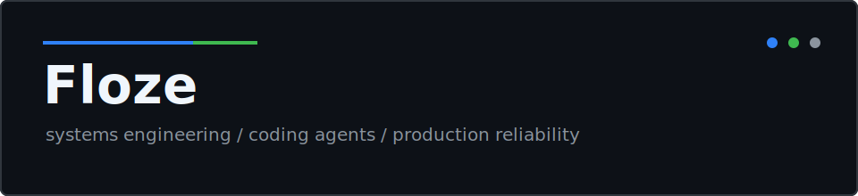

<!--
  Source of truth for the profile layout and curated prose.
  README.md is generated by scripts/generate_readme.py.
-->

  

  

    
    
  

  

    
    
    
  

I build and operate **developer tooling, coding-agent infrastructure, and production systems**. My work spans TypeScript and Node.js, Python and FastAPI, Go and Rust, PostgreSQL, Redis, Docker, GitHub Actions, and multi-service deployments.

I care about the parts that determine whether software survives contact with reality: compatibility boundaries, safe migrations, observability, CI, failure recovery, and reviewable changes.

## Maintained tools

{{MAINTAINED_PROJECTS}}

## Selected upstream work

| Project | Merged contribution | Engineering area |
| --- | --- | --- |
| [Svelte](https://github.com/sveltejs/svelte) | [Preserve select selection with spread attributes](https://github.com/sveltejs/svelte/pull/18561) | Compiler/runtime DOM behavior |
| [Kong kongctl](https://github.com/Kong/kongctl) | [Enforce saved declarative-plan execution modes](https://github.com/Kong/kongctl/pull/1655) | CLI execution safety and test coverage |
| [NGINX Gateway Fabric](https://github.com/nginx/nginx-gateway-fabric) | [Detect conflicting route policies across overlapping hostnames](https://github.com/nginx/nginx-gateway-fabric/pull/5605) | Kubernetes Gateway API validation |
| [zarrs](https://github.com/zarrs/zarrs) | [Add an atomic write storage adapter](https://github.com/zarrs/zarrs/pull/421) | Rust storage concurrency and API design |
| [MapLibre Martin](https://github.com/maplibre/martin) | [Restore AWS profile support for PMTiles](https://github.com/maplibre/martin/pull/3029) | Cloud credentials and Rust integration |
| [yay](https://github.com/Jguer/yay) | [Prefer repository replacements over matching AUR upgrades](https://github.com/Jguer/yay/pull/2910) | Package resolution correctness |

## Recent upstream merges

Automatically refreshed from public GitHub data. Repositories are de-duplicated so one project cannot dominate the list.

{{RECENT_MERGES}}

## GitHub signal

  

  
  

  

## Current focus

- OpenCode and Codex interoperability
- MCP gateways, authentication, and coding-agent reliability
- production-grade APIs, data systems, and deployment pipelines
- technically substantive upstream fixes across runtimes and infrastructure

## Stack

  
  
  
  
  
  
  
  
  
  

  <picture>
    <source media="(prefers-color-scheme: dark)" srcset="https://raw.githubusercontent.com/floze-the-genius/floze-the-genius/output/snake-dark.svg" />
    <source media="(prefers-color-scheme: light)" srcset="https://raw.githubusercontent.com/floze-the-genius/floze-the-genius/output/snake.svg" />
    
  </picture>

  Profile data is generated from verified public GitHub activity by <a href=".github/workflows/update-readme.yml">GitHub Actions</a>. Curated engineering notes remain hand-reviewed.

